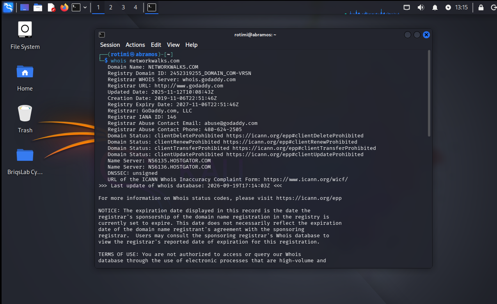
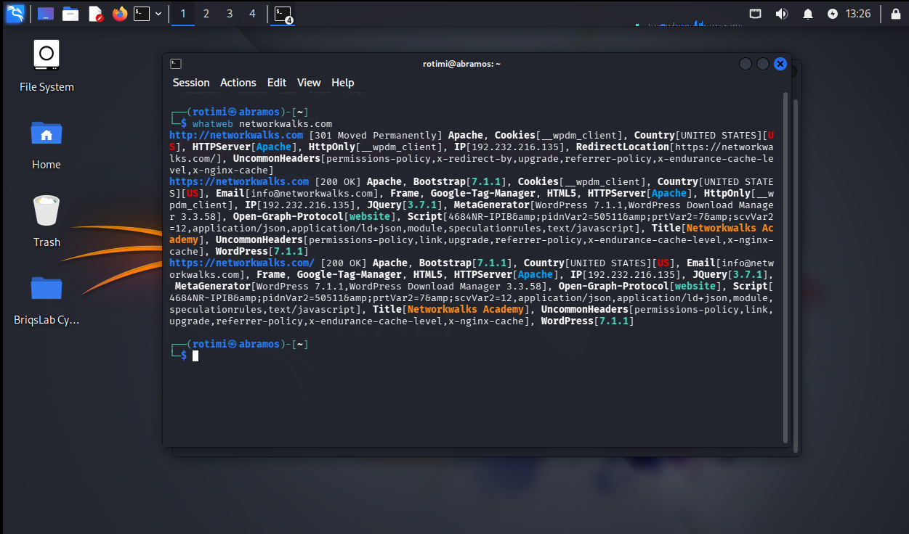
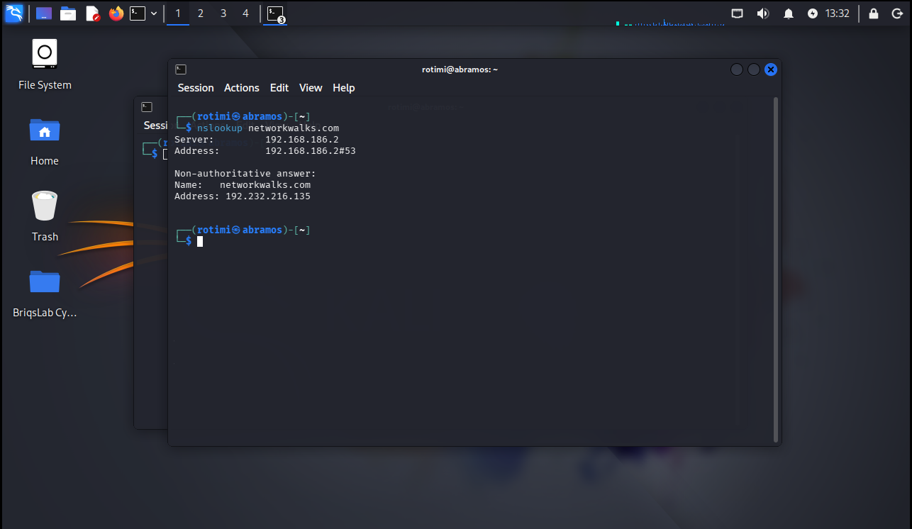
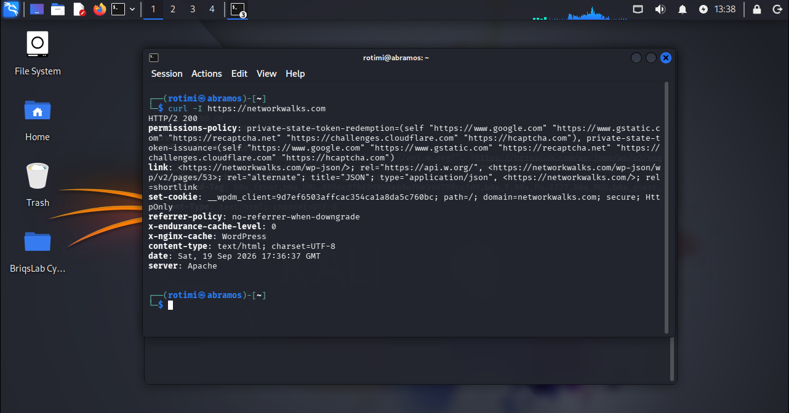
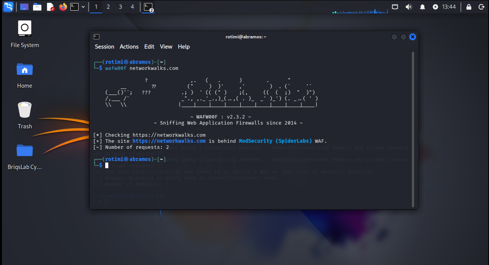
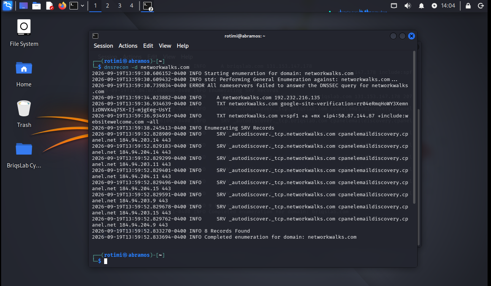
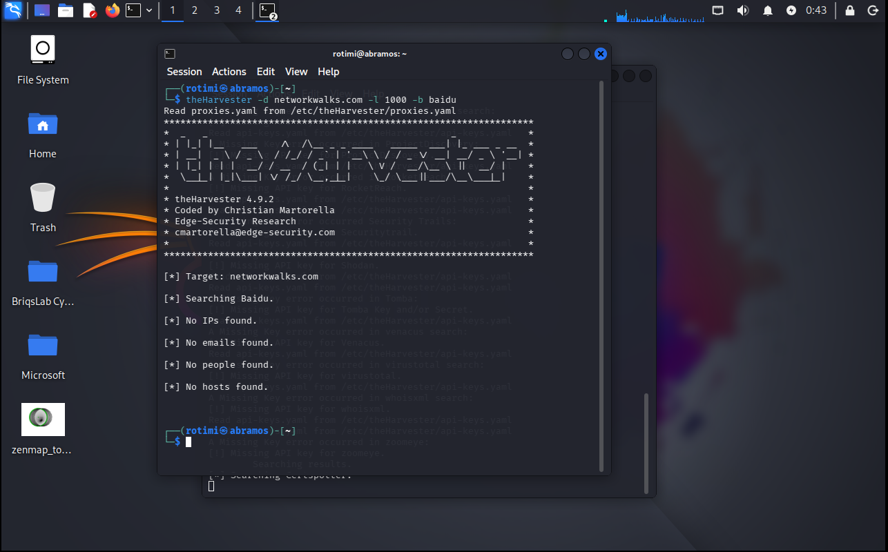
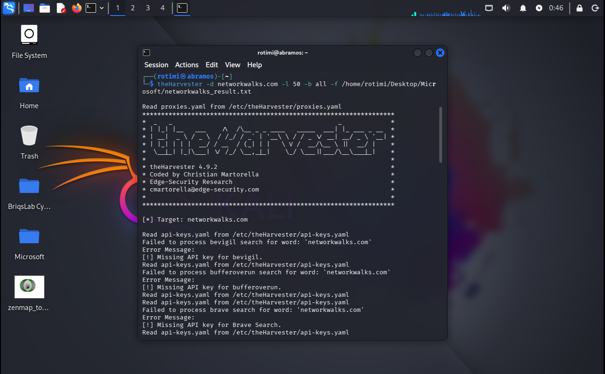
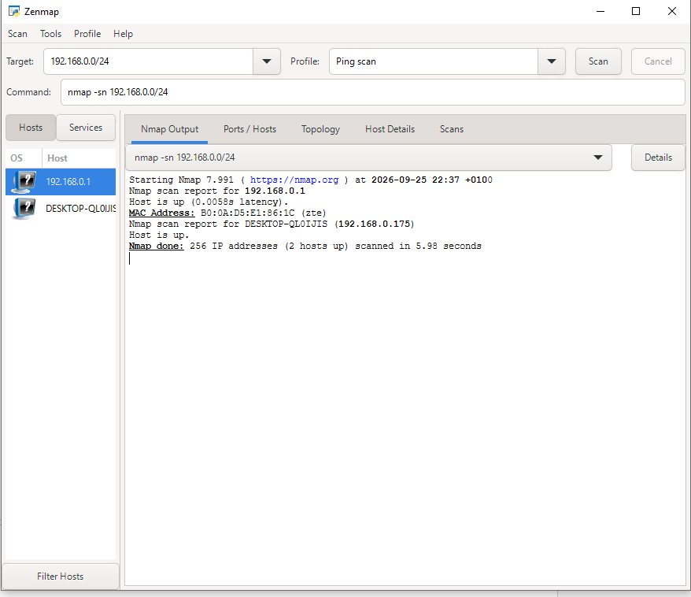
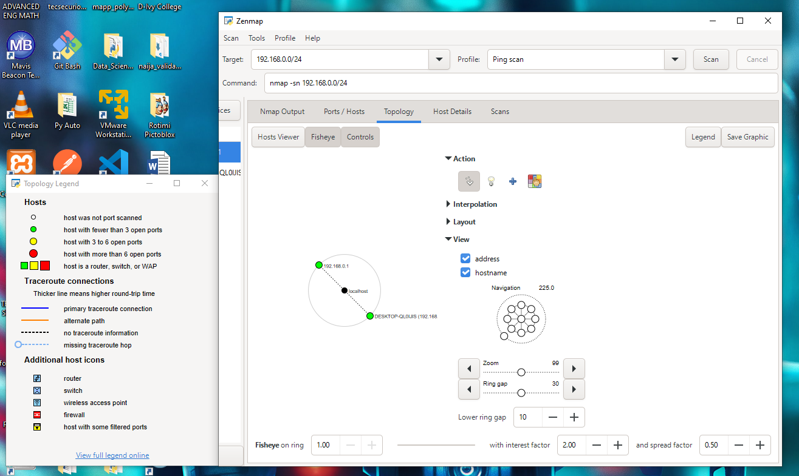

# NETWORKWALKS-ADEDUROTIMI-BO83-WK2-PM1-FOOTPRINTING-RECONNAISSANCE

# 🔍 Footprinting & Reconnaissance Report — networkwalks.com

**Type:** Passive & Active Reconnaissance (OSINT) + Local Network Discovery
**Target(s):** `networkwalks.com` (authorized), local LAN (`192.168.0.0/24`, own network)
**Date:** 19–25 September 2026
**Author:** *(Adedurotimi Aderemi)* — Cybersecurity Trainee, Networkwalks Program
**Environment:** Kali Linux (footprinting), Windows + Zenmap (network scanning)

---

## ⚠️ Liability Disclaimer

All activities documented in this report were performed only against systems and domains for which written permission had already been secured (`networkwalks.com`, as part of an authorized training program), or against my own local network. This report is for educational and portfolio purposes only. Unauthorized reconnaissance or scanning of systems you do not own or have explicit permission to test is illegal in most jurisdictions, even when no damage occurs. Do not use this content to test systems without authorization.

---

## 📖 Introduction

This report documents a footprinting and reconnaissance exercise against the domain `networkwalks.com`, followed by active host discovery on my local network using Zenmap (Nmap GUI). The goal was to demonstrate how an attacker could passively and actively gather information about a target — from domain registration data down to live hosts on a LAN — before any exploitation would ever take place.

Seven tools were used across two phases:

- **Phase 1 — Footprinting & OSINT (Kali Linux):** WHOIS, WhatWeb, Nslookup, Curl, Wafw00f, DNSRecon, theHarvester
- **Phase 2 — Network Discovery (Zenmap):** Ping scan + topology mapping of the local subnet

Each finding below includes the exact command run, the raw output observed, and a short note on why it matters from an attacker's perspective.

---

## 🛠️ Tools Used

| Tool | Purpose |
|---|---|
| **WHOIS** | Retrieve domain registration details (registrar, dates, name servers) |
| **WhatWeb** | Fingerprint web technologies (CMS, plugins, server, IP) |
| **Nslookup** | Resolve the domain name to its IP address via DNS |
| **Curl (`-I`)** | Inspect HTTP response headers |
| **Wafw00f** | Detect whether a Web Application Firewall is protecting the site |
| **DNSRecon** | Enumerate DNS records (A, TXT/SPF, SRV, DNSSEC status) |
| **theHarvester** | OSINT harvesting for emails, subdomains, IPs and hosts |
| **Zenmap (Nmap GUI)** | Ping scan + topology mapping of a local subnet |

---

## 🕵️ Phase 1: Footprinting & Reconnaissance

### 1. WHOIS — Domain Registration Lookup

```bash
$ whois networkwalks.com
```

```
Domain Name: NETWORKWALKS.COM
Registrar WHOIS Server: whois.godaddy.com
Updated Date: 2025-11-12T10:08:43Z
Creation Date: 2019-11-06T22:51:46Z
Registry Expiry Date: 2027-11-06T22:51:46Z
Registrar: GoDaddy.com, LLC
Registrar Abuse Contact Email: abuse@godaddy.com
Registrar Abuse Contact Phone: 480-624-2505
Domain Status: clientDeleteProhibited / clientRenewProhibited /
               clientTransferProhibited / clientUpdateProhibited
Name Server: NS6135.HOSTGATOR.COM
Name Server: NS6136.HOSTGATOR.COM
DNSSEC: unsigned
```

**Observation (networkwalks.com):** The domain is registered with GoDaddy but hosted via HostGator name servers, and is locked against transfer/deletion. DNSSEC is **unsigned**, meaning DNS responses for this domain cannot be cryptographically validated.

📸

---

### 2. WhatWeb — Web Technology Fingerprinting

```bash
$ whatweb networkwalks.com
```

Key results:

| Item | Value |
|---|---|
| CMS | WordPress **7.1.1** |
| Plugin | WP Download Manager **3.3.58** |
| Server | Apache |
| IP | 192.232.216.135 |
| Framework | Bootstrap 7.1.1, jQuery 3.7.1 |
| Cookie | `__wpdm_client` (HttpOnly) |
| Contact | info@networkwalks.com |
| Title | Networkwalks Academy |
| Redirect | HTTP → HTTPS (301) |

**Observation:** The exact CMS and plugin versions are publicly exposed. An attacker could cross-reference `WordPress 7.1.1` and `WP Download Manager 3.3.58` against known CVE databases to check for unpatched vulnerabilities.

📸

---

### 3. Nslookup — DNS Resolution

```bash
$ nslookup networkwalks.com
```

```
Server:   192.168.186.2
Address:  192.168.186.2#53

Non-authoritative answer:
Name:    networkwalks.com
Address: 192.232.216.135
```

**Observation:** Confirms the domain resolves to a single A record, `192.232.216.135` — matching the IP identified independently by WhatWeb.

📸

---

### 4. Curl — HTTP Response Header Inspection

```bash
$ curl -I https://networkwalks.com
```

```
HTTP/2 200
permissions-policy: private-state-token-redemption=(self "https://www.google.com" ...)
link: <https://networkwalks.com/wp-json/>; rel="https://api.w.org/",
      <https://networkwalks.com/wp-json/wp/v2/pages/53>; rel="alternate"; title="JSON"
set-cookie: __wpdm_client=9d7ef6503affcac354ca1a8da5c760bc; path=/; domain=networkwalks.com; secure; HttpOnly
referrer-policy: no-referrer-when-downgrade
x-endurance-cache-level: 0
x-nginx-cache: WordPress
content-type: text/html; charset=UTF-8
server: Apache
```

**Observation:** The response headers confirm and expand on WhatWeb's findings — the `wp-json` REST API endpoint is exposed and discloses a specific page ID (`/wp/v2/pages/53`), and `x-nginx-cache: WordPress` further fingerprints the caching layer/CMS stack.

📸

---

### 5. Wafw00f — WAF Detection

```bash
$ wafw00f networkwalks.com
```

```
[*] Checking https://networkwalks.com
[+] The site https://networkwalks.com is behind ModSecurity (SpiderLabs) WAF.
[~] Number of requests: 2
```

**Observation:** The site is actively protected by **ModSecurity (SpiderLabs)**. This tells an attacker that naive/unencoded payloads (e.g. basic SQLi or XSS strings) will likely be blocked, and that more evasive techniques would be required to bypass it — information that shapes attacker tooling choices.

📸

---

### 6. DNSRecon — DNS Record Enumeration

```bash
$ dnsrecon -d networkwalks.com
```

```
[-] ERROR: All nameservers failed to answer the DNSSEC query for networkwalks.com
[*] A     networkwalks.com   192.232.216.135
[*] TXT   networkwalks.com   google-site-verification=rr04eRmqHoWY3XemnizDNVK4q75X-Ij-mjgEeg-UsYI
[*] TXT   networkwalks.com   v=spf1 a +mx +ip4:50.87.144.87 +include:websitewelcome.com ~all
[*] Enumerating SRV Records
[*] SRV _autodiscover._tcp.networkwalks.com cpanelemaildiscovery.cpanel.net  184.94.203.9/11/14/15, 184.94.204.9/11/14/15 : 443
[*] 8 Records Found
[*] Completed enumeration for domain: networkwalks.com
```

**Observation:** DNSRecon confirms DNSSEC is not answering, exposes the SPF record (mail is routed through `websitewelcome.com`/IP `50.87.144.87`), and reveals **8 SRV records** pointing to `cpanelemaildiscovery.cpanel.net` across 8 backend IPs — strongly indicating the site is hosted on a shared cPanel/HostGator/Endurance International Group infrastructure.

📸

---

### 7. theHarvester — OSINT Harvesting

**Run 1** — single source (Baidu):

```bash
$ theHarvester -d networkwalks.com -l 1000 -b baidu
```
Result: **No IPs, emails, hosts, or people found.**

**Run 2** — all sources:

```bash
$ theHarvester -d networkwalks.com -l 50 -b all -f networkwalks_result.txt
```
Result: Most premium sources (Bevigil, BufferOverrun, Brave, Tomba, Venacus, VirusTotal, WhoisXML, ZoomEye, etc.) returned **"Missing API key"** errors rather than actual data — meaning this run did not produce reliable OSINT results because API keys were not configured.

**Observation:** theHarvester's value here was limited by missing API keys rather than by the target having no exposed OSINT footprint — this is a tooling limitation worth noting rather than a security finding. A follow-up run with valid API keys (or free sources like `crtsh`, `otx`, `hackertarget`) would give a more complete picture of exposed subdomains/emails.




---

## 🌐 Phase 2: Network Scanning with Zenmap

**Objective:** Identify my local IP/subnet, discover live hosts, and map the network topology.

```bash
C:\> nmap -sn 192.168.0.0/24
```

```
Starting Nmap 7.991 at 2026-09-25 22:37 +0100
Nmap scan report for 192.168.0.1
Host is up (0.0058s latency).
MAC Address: B0:0A:D5:E1:86:1C (ZTE)

Nmap scan report for DESKTOP-QL0UJIS (192.168.0.175)
Host is up.

Nmap done: 256 IP addresses (2 hosts up) scanned in 5.98 seconds
```

**Live hosts identified:**

| IP Address | Hostname | MAC Address / Vendor | Role |
|---|---|---|---|
| 192.168.0.1 | — | B0:0A:D5:E1:86:1C (ZTE) | Router / Gateway |
| 192.168.0.175 | DESKTOP-QL0UJIS | — | Local workstation (scanning machine) |

After the ping scan, I opened the **Topology** tab, enabled the legend, and confirmed both hosts appeared correctly connected to the gateway — the topology graphic was saved separately as required.

**Observation:** Only 2 of 256 possible addresses in the `/24` responded to ping, consistent with a small home/personal LAN. No unexpected or unidentified devices were found on the network at scan time.




---

## 📊 Risk Analysis / Impact

| # | Finding | Evidence | Potential Impact | Risk Level |
|---|---|---|---|---|
| 1 | CMS & plugin version exposed | WhatWeb: WordPress 7.1.1, WP Download Manager 3.3.58 | Attackers can check exposed versions against known CVEs | 🟠 Medium |
| 2 | Server IP identifiable | Nslookup/WhatWeb: 192.232.216.135 | Reveals hosting location/provider | 🟢 Low |
| 3 | REST API & cookie details exposed | Curl: `/wp-json/wp/v2/pages/53`, `__wpdm_client` cookie | Assists further enumeration of site structure/plugins | 🟢 Low |
| 4 | WAF identified | Wafw00f: ModSecurity (SpiderLabs) | Discloses security architecture, informs evasion strategy | 🟢 Low |
| 5 | Mail/DNS infrastructure exposed | DNSRecon: SPF, 8 SRV records via cPanel/Endurance hosting | Builds a broader infrastructure/hosting profile | 🟠 Medium |
| 6 | DNSSEC not enforced | WHOIS/DNSRecon: DNSSEC unsigned, nameservers failed to answer DNSSEC query | Domain is more susceptible to DNS spoofing/cache poisoning in theory | 🟠 Medium |
| 7 | Live hosts identified on local network | Zenmap: 2 hosts (gateway + workstation) with IP/MAC | Confirms network composition; unknown devices would be a concern | 🟢 Low |

**Risk level key:** 🔴 Critical · 🟠 Medium · 🟢 Low

> These are observations from reconnaissance only — **no exploitation or vulnerability validation was performed.** The presence of a version number, IP address, or DNS record does not by itself confirm a vulnerability; further authorized testing would be required to validate any of these as actual risks.

---

## ✅ Recommendations

1. **Review publicly exposed technology info** — audit what CMS/plugin details are visible via headers, meta tags, and fingerprinting tools.
2. **Keep WordPress & plugins updated** — verify WordPress 7.1.1 and WP Download Manager 3.3.58 against current CVEs and patch as needed.
3. **Harden HTTP headers** — consider restricting `wp-json` API exposure and reviewing unnecessary headers (`x-nginx-cache`, `x-endurance-cache-level`) that hint at the hosting stack.
4. **Enable DNSSEC** — currently unsigned; enabling it would protect against DNS spoofing/cache-poisoning attacks.
5. **Keep the WAF tuned** — ModSecurity is active and should be monitored/updated regularly rather than treated as a "set and forget" control.
6. **Review DNS/SPF/SRV records periodically** — ensure only necessary mail and service records are publicly exposed.
7. **Perform regular internal network discovery** — periodically re-scan the LAN to confirm no unexpected devices have joined.
8. **Re-run OSINT tooling with proper API keys** — theHarvester's results were inconclusive due to missing keys; a fuller OSINT pass would give more complete visibility into the organization's footprint.
9. **Always operate within authorized scope** — all reconnaissance/scanning here was performed only against permitted targets.

---

## 🧾 Conclusion

This exercise walked through the full lifecycle of passive and active reconnaissance: starting from public domain registration data (WHOIS), moving into technology fingerprinting (WhatWeb, Curl), DNS enumeration (Nslookup, DNSRecon), security control detection (Wafw00f), broader OSINT gathering (theHarvester), and finally active host discovery on a local network (Zenmap).

The biggest takeaway is how much can be learned about a target **before ever sending an exploit** — CMS versions, hosting provider, mail infrastructure, WAF vendor, and even backend IPs, all from public information and normal-looking requests. It also highlighted a practical limitation: tools like theHarvester are only as good as the API keys configured behind them, so a "no results" output doesn't always mean "nothing to find."

Reconnaissance and scanning should always be performed within an authorized scope — every activity in this report was carried out against a domain with secured written permission, or against my own local network.

---

## 📁 Evidence

All screenshots referenced above are stored in [`/screenshots`](./screenshots):

- `01_whois-net.PNG`
- `02_whatweb-net.PNG`
- `03_nslookup-net.PNG`
- `04_curl-net.PNG`
- `05_wafw00f-net.PNG`
- `06_dnsrecon-net.PNG`
- `theHarvester-net.PNG`, `theHarvester-net1.PNG`
- `09_zenmap.PNG`, `09_zenmap1.PNG`

---

**👤 Author:** *(add your name)*
**Program:** Cybersecurity & Ethical Hacking Internship — Networkwalks | Week 2
**LinkedIn:** *(add your LinkedIn, optional)*
